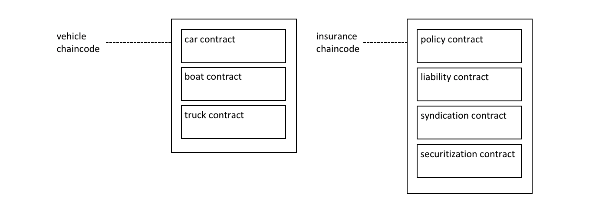
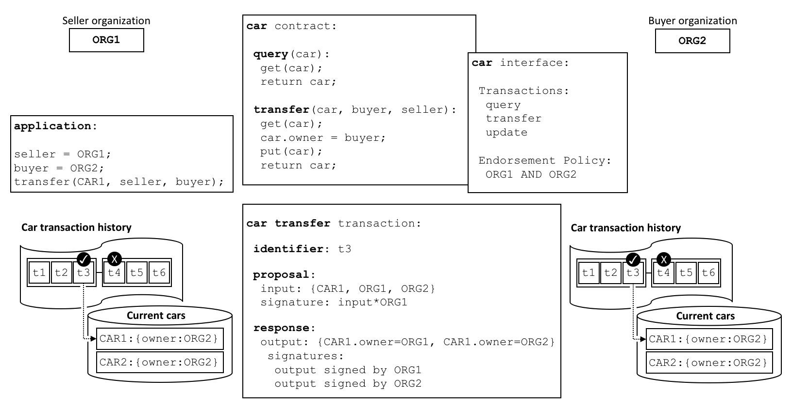

# What is Hyperledger?

- “Hyperledger is an open sourced community of communities to benefit an ecosystem of Hyperledger based solution providers and users focused on blockchain related use cases that will work across a variety of industrial sectors.“ – Theo Brian Behlendorf, Giám đốc điều hành của Hyperledger.

- Hyperledger là một dự án mã nguồn mở, nó xây dựng một hệ sinh thái các giải pháp và người dùng trên nền tảng công nghệ blockchain nhằm giải quyết các vấn đề trong ngành công nghiệp.

- Hyperledger thuộc tổ chức Linux Foundation.
  Tư tưởng của Hyperledger là thế giới sẽ gồm nhiều kênh thanh toán (private chain) riêng biệt với các thị trường khác nhau. Mỗi doanh nghiệp có những đặc trưng riêng, nên các ứng dụng cho các doanh nghiệp sẽ cần phát triển với các quy tắc được cá nhân hóa. Không giống như ethereum có xu hướng buộc các nhà phát triển xây dựng các ứng dụng của họ xung quanh một bộ giao thức định sẵn.

# How Does It Work?

- Trên mạng Hyperledger, các peer liên kết trực tiếp với nhau và chỉ có sổ cái của riêng họ được cập nhật về thỏa thuận giao dịch. Các bên giúp thực hiện giao dịch chỉ được biết một lượng thông tin đủ để họ cần để chuyển tiếp và cho phép giao dịch trên mạng.

- Tất cả điều này được thực hiện nhờ kiến ​​trúc mô đun của Hyperledger, nó làm cho các cơ chế như thuật toán đồng thuật trở thành một tính năng có thể tùy biến (plug-and-play). Trong kiến ​​trúc này, những đăc điểm đáng chú ý nhất được thể hiện trong các peer của mạng. Các peer đã được chia thành ba vai trò riêng biệt, đó là:

  - Endorser: Các endorser là những peer thực thi các giao dịch trong chaincode container và đề xuất giao dịch lên mạng dựa trên kết quả của hợp đồng thông minh. Tất cả các endoser peer phải được cài đặt chaincode.

  - Committer: Đây là những peer không nhất thiết phải cài đặt chaincode, chúng lưu trữ sổ cái đầy đủ (full ledger). Sự khác biệt chính giữa committer peer và endoser peer là việc committer peer không thể gọi chaincode hoặc chạy các hàm trong hợp đồng thông minh.

  - Consenters: Các nút này chịu trách nhiệm điều hành sự đồng thuận của mạng. Consenters có trách nhiệm xác nhận các giao dịch và quyết định các giao dịch sẽ được đưa vào sổ cái.

# Hyperleger Fabric

## What is Hyperledger Fabric?

Hyperedger Fabric là một trong 5 Framework về Blockchain nằm trong chiến lược Hyperledger Umbrella của Linux Foundation gồm : Hyperledger Indy, Hyperledger Fabric, Hyperledger Iroha, Hyperledger Sawtooth, Hyperledger Burror. Điều đặc biệt là Hyperledger Fabric được contributed bởi ông lớn IBM.

Hyperledger Fabric được xem là có tính mô đun tương đối cao. Hơn nữa Hyperledger Fabric hoạt động khá linh hoạt và nó còn cung cấp cho doanh nghiệp một bộ khung để xây dựng Private Blockchain. Đó là lý do tại sao các doanh nghiệp có thể dễ dàng xây dựng một ứng dụng Private Blockchain phù hợp các yêu cầu nghiệp vụ của mình.

## Hyperledger Fabric Architechture & Components

Một mạng Hyperledger Fabric bao gồm nhiều tổ chức tương tác lẫn nhau. Mỗi tổ chức được định nghĩa bởi chứng chỉ gốc (root cert) dành riêng cho tổ chức đó và được lưu trên Fabric Certificate Authority. Các user và thành phần khác của tổ chức được định danh bằng chứng chỉ dựa trên chứng chỉ gốc này. Các chứng chỉ này cũng chỉ định các quyền cho từng đối tượng trên mạng (read-only, full access,...).


- Assets: Asset là đại diện số cho một đối tượng nào đó trong thế giới thực. Asset được biểu diễn trong Hyperledger Fabric dưới dạng cặp key-value. Trạng thái của asset có thể thay đổi bằng chaincode. Các trạng thái của assets khi thay đổi đều được ghi lại dưới dạng transaction. Asset có thể được biểu diễn dưới dạng nhị phân hoặc JSON.

- Chaincode: Chaincode là phần mềm định nghĩa asset và transaction instructions for modifying assets. Chaincode enforces the rules for reading or altering key-value pairs or other state database information. Các hàm chaincode thực thi dựa trên state db hiện tại của ledger và được khởi tạo thông qua một đề xuất giao dịch. Kết quả thực thi của chaincode là một set các lần ghi key-value, được gửi lên network và lưu vào ledger trên tất cả các peer.

- Ledger: Ledger lưu các state transition, là kết quả của các lệnh gọi chaincode do các peer gửi. Một ledger có 2 phần là "Transaction Log" và "State Database". Default: LevelDB. Transaction Log is immutable. There is only one ledger per channel. Each peer maintains a copy of the ledger for each channel of which they are a member. The copy of the ledger kept by the ordering service does not contain a state database.

- Policies: Policies typically describe a who and a what, such as the access or rights that an individual has over an asset. Policies are one of the things that make Hyperledger Fabric different from other blockchains like Ethereum or Bitcoin. Because Fabric is a permissioned blockchain whose users are recognized by the underlying infrastructure, those users have the ability to decide on the governance of the network before it is launched, and change the governance of a running network.

- Nodes:

  - Orderers: Communication channel for fabric. Nếu như trong Public Blockchain, tất cả các node của mạng đều tham gia vào quá trình đồng thuận, thì ở Hyperledger Fabric chỉ có Orderer tham gia vào quá trình đó. Implemented with Message Oriented Middleware (Default: SOLO).
  - Peers: Maintain its own copy of ledger.
    - Lead peers: Receive blocks from orderers. May be either statically or dynamically assigned.
    - Anchor peers: They are known outside Organization. They are the only peer instances within an organization that are discoverable. Each organization must have at least one anchor peer.
  - Clients: Act on behalf of end users. They create transaction requests and submit to the network.

- Channels:
  - Transactions isolated within the channel. In other words, transactions created on one channel are available only to the members of that channel.
  - Each channel has its own distributed ledger.
  - Chaincode deployed to a channel, not to the network.
  - Bootstrap channel is automatically created at the time of the network initialization.
  - Organizations or peers can join multi channels.

## How Fabric Networks are Structured?

### Creating the Network

The first step in creating a network or a channel is to agree to and then define its configuration. A block known as a “configuration block” that is, typically, created by the configtxgen tool from a configtx.yaml file.

This configuration block contains a record of the organizations that can join components and interact on the channel, as well as the policies that define the structure for how decisions are made and specific outcomes are reached.

The definitions of these organizations, and the identities of their admins, must be created by a Certificate Authority (CA) associated with each organization. The mapping of certificates to member organizations is achieved via a structure called a Membership Services Provider (MSP), which defines an organization by creating an MSP which is tied to a root CA certificate to identify that components and identities were created by the root CA.

### Install, Approve, and Commit a Chaincode

Chaincodes are installed on peers, and then defined and committed on a channel. The ordering service does not have the chaincode installed on it, as ordering nodes do not typically propose transactions. The process of installing, approving, and committing a chaincode is known as the “lifecycle” of the chaincode.

The most important piece of information supplied within the chaincode definition is the endorsement policy. It describes which organizations must endorse transactions before they will be accepted by other organizations onto their copy of the ledger.

### Using an Application on the Channel

After a smart contract has been committed, client applications can be used to invoke transactions on a chaincode, via the Fabric Gateway service (the gateway). Just like peers and orderers, a client application has an identity that associates it with an organization.

# Key Concepts of Hyperledger Fabric

## Smart Contracts and Chaincode

### Smart Contract vs Chaincode

In general, a smart contract defines the transaction logic that controls the lifecycle of a business object contained in the world state. It is then packaged into a chaincode which is then deployed to a blockchain network. Think of smart contracts as governing transactions, whereas chaincode governs how smart contracts are packaged for deployment.

A smart contract is defined within a chaincode. Multiple smart contracts can be defined within the same chaincode. When a chaincode is deployed, all smart contracts within it are made available to applications.



### Ledger

A smart contract programmatically accesses two distinct pieces of the ledger – a blockchain, which immutably records the history of all transactions, and a world state that holds a cache of the current value of these states, as it’s the current value of an object that is usually required.

### Endorsement

Associated with every chaincode is an endorsement policy that applies to all of the smart contracts defined within it. This endorsement policy identifies which organizations must approve transactions generated by the smart contract before those transactions can be identified as valid. All transactions, whether valid or invalid are added to a distributed ledger, but only valid transactions update the world state.

Endorsement policies are what make Hyperledger Fabric different to other blockchains like Ethereum or Bitcoin. In these systems valid transactions can be generated by any node in the network. Hyperledger Fabric more realistically models the real world; transactions must be validated by trusted organizations in a network.

### Valid Transactions

When a smart contract executes, it runs on a peer node owned by an organization in the blockchain network. All transactions have an identifier, a proposal - a set of input parameters, and a response - a read-write set that will changes the world state, signed by a set of organizations.



A transaction that is distributed to all peer nodes in the network is validated in two phases by each peer. Firstly, the transaction is checked to ensure it has been signed by sufficient organizations according to the endorsement policy. Secondly, it is checked to ensure that the current value of the world state matches the read set of the transaction when it was signed by the endorsing peer nodes; that there has been no intermediate update. If a transaction passes both these tests, it is marked as valid.

### Intercommunication

A Smart Contract can call other smart contracts both within the same channel and across different channels.

### System chaincode

A chaincode can also define low-level program code which corresponds to domain independent system interactions.

- \_lifecycle: runs in all peers and manages the installation of chaincode on peers, the approval of chaincode definitions for organization, and the committing of chaincode definitions to channels.
- Lifecycle System Chaincode (LSCC): manages the chaincode lifecycle
- Configuration System Chaincode (CSCC): runs in all peers to handle changes to a channel configuration, such as a policy update.
- Query System Chaincode (QSCC): runs in all peers to provide ledger APIs which include block query, transaction query etc.
- Endorsement System Chaincode (ESCC): runs in endorsing peers to cryptographically sign a transaction response.
- Validation System Chaincode (VSCC): validates a transaction, including checking endorsement policy and read-write set versioning.

## Fabric Chaincode Lifecycle

### What is Chaincode?

Chaincode is a program, written in Go, Node.js, or Java that implements a prescribed interface. Chaincode runs in a secured Docker container isolated from the endorsing peer process. Chaincode initializes and manages ledger state through transactions submitted by applications.

Ledger updates created by a chaincode are scoped exclusively to that chaincode and can’t be accessed directly by another chaincode. However, within the same network, given the appropriate permission a chaincode may invoke another chaincode to access its state.

### Chaincode Lifecycle

The Fabric chaincode lifecycle is a process that allows multiple organizations to agree on how a chaincode will be operated before it can be used on a channel.

#### Install and Define a Chaincode

Fabric chaincode lifecycle requires that organizations agree to the parameters that define a chaincode, such as name, version, and the chaincode endorsement policy. Channel members come to agreement using the following four steps. Not every organization on a channel needs to complete each step.

<b>1. Package the chaincode</b>:
Chaincode cần được đóng gói thành file tar trước khi cài đặt lên peer. Khi đóng gói chaincode, cần tạo package label để người khác có thể đọc hiểu về mô tả của chaincode. The tar file needs to contain two files (no directory): a metadata file “metadata.json” and another tar “code.tar.gz” containing the chaincode files. “metadata.json” contains JSON that specifies the chaincode language, code path, and package label (For example: {"Path":"fabric-samples/asset-transfer-basic/chaincode-go","Type":"golang","Label":"basicv1"})

<b>2. Install the chaincode on peers</b>:
Cần cài đặt chaincode trên tất cả peer nào sẽ thực thi và xác nhận transactions. A successful install command will return a chaincode package identifier, which is the package label combined with a hash of the package. This package identifier is used to associate a chaincode package installed on your peers with a chaincode definition approved by your organization.

<b>3. Approve a chaincode definition for organization</b>:
Một chaincode được quản lý bằng chaincode definition. Chaincode definition bao gồm các tham số sau, cần phải nhất quán giữa các tổ chức:

- Name: Các ứng dụng gọi chaincode thông qua tên này
- Version: Phiên bản của chaincode package. Nếu upgrade binaries của chaincode thì version này cũng thay đổi theo. Format thường dùng: v1.2.3.
- Sequence: Số lần chaincode đã được define trên 1 channel, dùng để quản lý những lần nâng cấp của chaincode. For example, when you first approve and commit a chaincode definition on a channel, the sequence number must be set to 1. When you next upgrade the chaincode or update the chaincode definition, increment the sequence number to 2. Tham số sequence này được dùng bởi các peer để đảm bảo tất cả các org luôn đồng bộ về chaincode definitions. All channel members need to increment the sequence number by one and approve a new definition to upgrade the chaincode.
- Endorsement Policy: Chính sách chứng thực quy định tổ chức nào cần thực thi và xác thực kết quả giao dịch. Nó có thể được thể hiện dưới dạng chuỗi truyền vào cli hoặc là tham chiếu của 1 chính sách trong cấu hình của kênh.
- Collection Configuration: The path to a private data collection definition file associated with your chaincode.
- ESCC / VSCC Plugins: The name of a custom endorsement or validation plugin to be used by this chaincode.
- Initialization: If you use the low level APIs provided by the Fabric Chaincode Shim API, your chaincode needs to contain an Init function that is used to initialize the chaincode. This function is required by the chaincode interface, but does not necessarily need to invoked by your applications. When you approve a chaincode definition, you can specify whether Init must be called prior to Invokes. If you specify that Init is required, Fabric will ensure that the Init function is invoked before any other function in the chaincode and is only invoked once. Requesting the execution of the Init function allows you to implement logic that is run when the chaincode is initialized, for example to set some initial state. You will need to call Init to initialize the chaincode every time you increment the version of a chaincode, assuming the chaincode definition that increments the version indicates that Init is required.

If you are using the Fabric contract API, you do not need to include an Init method in your chaincode. However, you can still use the <i>--init-required</i> flag to request that the chaincode be initialized by a call from your applications. If you use the <i>--init-required</i> flag, you will need to pass the <i>--isInit</i> flag or parameter to a chaincode call in order to initialize the chaincode every time you increment the chaincode version.

The chaincode definition also includes the Package Identifier. This is a required parameter for each organization that wants to use the chaincode. The package ID does not need to be the same for all organizations.

However, an organization can approve a chaincode definition without installing a chaincode package or including the identifier in the definition.

If a channel member (Org) wants to use the chaincode, an approval needs to be submitted to the ordering service, after which it is distributed to all peers. This approval needs to be submitted by the Organization Administrator. After the approval transaction has been successfully submitted, the approved definition is stored in a collection that is available to all the peers of the organization. As a result you only need to approve a chaincode for your organization once, even if you have multiple peers.

<b>4. Commit the chaincode definition to the channel</b>:
Once a sufficient number of channel members have approved a chaincode definition, one organization can commit the definition to the channel.

The commit transaction proposal is first sent to the peers of channel members, who query the chaincode definition approved for their organizations and endorse the definition if their organization has approved it. The transaction is then submitted to the ordering service, which then commits the chaincode definition to the channel. The commit definition transaction needs to be submitted as the Organization Administrator.

The number of organizations that need to approve a definition before it can be successfully committed to the channel is governed by the <i>Channel/Application/LifecycleEndorsement</i> policy. y default, this policy requires that a majority of organizations in the channel endorse the transaction.

You can also set the <i>Channel/Application/LifecycleEndorsement</i> policy to be a signature policy and explicitly specify the set of organizations on the channel that can approve a chaincode definition.

An organization can approve a chaincode definition without installing the chaincode package.

After the chaincode definition has been committed to the channel, the chaincode container will launch on all of the peers where the chaincode has been installed, allowing channel members to start using the chaincode.

#### Upgrade Chaincode

Nếu upgrade binaries thì thực hiện các bước như lần đầu install chaincode.

#### Deployment Scenarios

<b>1. Joining a channel</b>
A new organization can join a channel with a chaincode already defined, and start using the chaincode after installing the chaincode package and approving the chaincode definition that has already been committed to the channel.

After approving the chaincode definition, the new organization can start using the chaincode after the package has been installed on their peers. The definition does not need to be committed again. If the endorsement policy is set the default policy that requires endorsements from a majority of channel members, then the endorsement policy will be updated automatically to include the new organization.

<b>2. Updating an endorsement policy</b>
You can use the chaincode definition to update an endorsement policy without having to repackage or re-install the chaincode. Channel members can approve a chaincode definition with a new endorsement policy and commit it to the channel. They increment the definition sequence from one to two, but do not need to update the chaincode version.

<b>3. One organization disagrees on the chaincode definition</b>
An organization that does not approve a chaincode definition that has been committed to the channel cannot use the chaincode. Organizations that have either not approved a chaincode definition, or approved a different chaincode definition will not be able to execute the chaincode on their peers.

An organization can approve a new chaincode definition with any sequence number or version. This allows you to approve the definition that has been committed to the channel and start using the chaincode.

<b>4. Creating multiple chaincodes using one package</b>
You can use one chaincode package to create multiple chaincode instances on a channel by approving and committing multiple chaincode definitions. Each definition needs to specify a different chaincode name. This allows you to run multiple instances of a smart contract on a channel, but have the contract be subject to different endorsement policies.

## Membership Service Provider (MSP)

# Working with Hyperledger Fabric

## Install Fabric

- `curl -sSLO https://raw.githubusercontent.com/hyperledger/fabric/main/scripts/install-fabric.sh && chmod +x install-fabric.sh` (lấy install scripts)

- `./install-fabric.sh docker samples` (install fabric images & clone fabric samples)

- `curl -sSLO https://raw.githubusercontent.com/hyperledger/fabric/main/scripts/bootstrap.sh` (get bootstrap scripts to install binaries)

## Using the Test Network

- `./network.sh up`
- `./network.sh down`
- `./network.sh createChannel -c channelname`
  NOTE: Make sure the name of the channel applies the following restrictions:

  - contains only lower case ASCII alphanumerics, dots ‘.’, and dashes ‘-‘
  - is shorter than 250 characters
  - starts with a letter

- `./network.sh deployCC -ccn basic -ccp ../asset-transfer-basic/chaincode-javascript -ccl javascript -c channelname`
  NOTE: If error `sudo apt-get install -y jq`

- `export PATH=${PWD}/../bin:$PATH` (add binaries to your CLI Path)
- `export FABRIC_CFG_PATH=$PWD/../config/` ( set the FABRIC_CFG_PATH to point to the core.yaml file in the fabric-samples repository)
- `export CORE_PEER_TLS_ENABLED=true`
  `export CORE_PEER_LOCALMSPID="Org1MSP"`
  `export CORE_PEER_TLS_ROOTCERT_FILE=${PWD}/organizations/peerOrganizations/org1.example.com/peers/peer0.org1.example.com/tls/ca.crt`
  `export CORE_PEER_MSPCONFIGPATH=${PWD}/organizations/peerOrganizations/org1.example.com/users/Admin@org1.example.com/msp`
  `export CORE_PEER_ADDRESS=localhost:7051` ( set the environment variables that allow you to operate the peer CLI as Org1. The CORE_PEER_TLS_ROOTCERT_FILE and CORE_PEER_MSPCONFIGPATH environment variables point to the Org1 crypto material in the organizations folder.)

- `peer chaincode invoke -o localhost:7050 --ordererTLSHostnameOverride orderer.example.com --tls --cafile "${PWD}/organizations/ordererOrganizations/example.com/orderers/orderer.example.com/msp/tlscacerts/tlsca.example.com-cert.pem" -C channelname -n basic --peerAddresses localhost:7051 --tlsRootCertFiles "${PWD}/organizations/peerOrganizations/org1.example.com/peers/peer0.org1.example.com/tls/ca.crt" --peerAddresses localhost:9051 --tlsRootCertFiles "${PWD}/organizations/peerOrganizations/org2.example.com/peers/peer0.org2.example.com/tls/ca.crt" -c '{"function":"InitLedger","Args":[]}'` (initialize the ledger with assets)

- `peer chaincode query -C channelname -n basic -c '{"Args":["GetAllAssets"]}'` (query the ledger from your CLI)

- `peer chaincode invoke -o localhost:7050 --ordererTLSHostnameOverride orderer.example.com --tls --cafile "${PWD}/organizations/ordererOrganizations/example.com/orderers/orderer.example.com/msp/tlscacerts/tlsca.example.com-cert.pem" -C channelname -n basic --peerAddresses localhost:7051 --tlsRootCertFiles "${PWD}/organizations/peerOrganizations/org1.example.com/peers/peer0.org1.example.com/tls/ca.crt" --peerAddresses localhost:9051 --tlsRootCertFiles "${PWD}/organizations/peerOrganizations/org2.example.com/peers/peer0.org2.example.com/tls/ca.crt" -c '{"function":"TransferAsset","Args":["asset6","Christopher"]}'` (change the owner of an asset on the ledger by invoking the asset-transfer (basic) chaincode.
  Because the endorsement policy for the asset-transfer (basic) chaincode requires the transaction to be signed by Org1 and Org2, the chaincode invoke command needs to target both peer0.org1.example.com and peer0.org2.example.com using the --peerAddresses flag. Because TLS is enabled for the network, the command also needs to reference the TLS certificate for each peer using the --tlsRootCertFiles flag.)

  ## Setup Logspout (Optional)

  This step is not required but is extremely useful for troubleshooting chaincode. To monitor the logs of the smart contract, an administrator can view the aggregated output from a set of Docker containers using the logspout tool.

  - `cd fabric-samples/test-network`
  - `./monitordocker.sh fabric_test` (fabric_test is network's name)

  When you are finished using the chaincode, you can also use the following commands to remove the Logspout tool.
  <code>docker stop logspout
  docker rm logspout</code>

  ## Deploy a Smart Contract to a Channel

  ### Package the Smart Contract

  We need to package the chaincode before it can be installed on our peers.

  - Before we package the chaincode, we need to install the chaincode dependencies. Navigate to the folder that contains the JavaScript version of the asset-transfer (basic) chaincode.
    `cd fabric-samples/asset-transfer-basic/chaincode-javascript`

  - To install the smart contract dependencies, run the following command from the asset-transfer-basic/chaincode-javascript directory.
    ``npm install`

  - Now that we that have our dependencies, we can create the chaincode package. Navigate back to our working directory in the test-network folder so that we can package the chaincode together with our other network artifacts.
    `cd ../../test-network`

  - You can use the peer CLI to create a chaincode package in the required format. The peer binaries are located in the bin folder of the fabric-samples repository. Use the following command to add those binaries to your CLI Path
    `export PATH=${PWD}/../bin:$PATH`

  - Set the FABRIC_CFG_PATH to point to the core.yaml file in the fabric-samples repository
    `export FABRIC_CFG_PATH=$PWD/../config/`

  - Check the version of the binaries
    `peer version`

  - Create the chaincode package using the peer lifecycle chaincode package command:
    `peer lifecycle chaincode package basic.tar.gz --path ../asset-transfer-basic/chaincode-javascript/ --lang node --label basic_1.0`
    This command will create a package named basic.tar.gz in your current directory. The --lang flag is used to specify the chaincode language and the --path flag provides the location of your smart contract code. The --label flag is used to specify a chaincode label that will identify your chaincode after it is installed. It is recommended that your label include the chaincode name and version.

### Install the Chaincode Package

The chaincode needs to be installed on every peer that will endorse a transaction.

- Set the following environment variables to operate the peer CLI as the Org1 admin user.
  <code>export CORE_PEER_TLS_ENABLED=true
  export CORE_PEER_LOCALMSPID="Org1MSP"
  export CORE_PEER_TLS_ROOTCERT_FILE=${PWD}/organizations/peerOrganizations/org1.example.com/peers/peer0.org1.example.com/tls/ca.crt
export CORE_PEER_MSPCONFIGPATH=${PWD}/organizations/peerOrganizations/org1.example.com/users/Admin@org1.example.com/msp
  export CORE_PEER_ADDRESS=localhost:7051</code>

- Install chaincode on peer Org1
  `peer lifecycle chaincode install basic.tar.gz`

- Set the following environment variables to operate as the Org2 admin and target the Org2 peer
  <code>export CORE_PEER_LOCALMSPID="Org2MSP"
  export CORE_PEER_TLS_ROOTCERT_FILE=${PWD}/organizations/peerOrganizations/org2.example.com/peers/peer0.org2.example.com/tls/ca.crt
export CORE_PEER_MSPCONFIGPATH=${PWD}/organizations/peerOrganizations/org2.example.com/users/Admin@org2.example.com/msp
  export CORE_PEER_ADDRESS=localhost:9051</code>

- Install như cũ

The chaincode is built by the peer when the chaincode is installed.

### Approve a Chaincode Definition

After you install the chaincode package, you need to approve a chaincode definition for your organization. The definition includes the important parameters of chaincode governance such as the name, version, and the chaincode endorsement policy.

If an organization has installed the chaincode on their peer, they need to include the packageID in the chaincode definition approved by their organization. The package ID is used to associate the chaincode installed on a peer with an approved chaincode definition, and allows an organization to use the chaincode to endorse transactions.

- Find packageID
  `peer lifecycle chaincode queryinstalled`

- Save it as an environment variable
  `export CC_PACKAGE_ID={previous_gen_package_id}`

- Chaincode is approved at the organization level, so the command only needs to target one peer.
  `peer lifecycle chaincode approveformyorg -o localhost:7050 --ordererTLSHostnameOverride orderer.example.com --channelID channelname --name basic --version 1.0 --package-id $CC_PACKAGE_ID --sequence 1 --tls --cafile "${PWD}/organizations/ordererOrganizations/example.com/orderers/orderer.example.com/msp/tlscacerts/tlsca.example.com-cert.pem"`
  You need to approve a chaincode definition with an identity that has an admin role. As a result, the CORE_PEER_MSPCONFIGPATH variable needs to point to the MSP folder that contains an admin identity.

- Operate as Org1 admin
  <code>export CORE_PEER_LOCALMSPID="Org1MSP"
  export CORE_PEER_MSPCONFIGPATH=${PWD}/organizations/peerOrganizations/org1.example.com/users/Admin@org1.example.com/msp
export CORE_PEER_TLS_ROOTCERT_FILE=${PWD}/organizations/peerOrganizations/org1.example.com/peers/peer0.org1.example.com/tls/ca.crt
  export CORE_PEER_ADDRESS=localhost:7051</code>

- `peer lifecycle chaincode approveformyorg -o localhost:7050 --ordererTLSHostnameOverride orderer.example.com --channelID channelname --name basic --version 1.0 --package-id $CC_PACKAGE_ID --sequence 1 --tls --cafile "${PWD}/organizations/ordererOrganizations/example.com/orderers/orderer.example.com/msp/tlscacerts/tlsca.example.com-cert.pem"`

If you commit the definition before a channel member has approved the chaincode, the organization will not be able to endorse transactions. As a result, it is recommended that all channel members approve a chaincode before committing the chaincode definition.

### Committing the Chaincode Definition to the Channel

- Check whether channel members have approved the same chaincode definition
  `peer lifecycle chaincode checkcommitreadiness --channelID channelname --name basic --version 1.0 --sequence 1 --tls --cafile "${PWD}/organizations/ordererOrganizations/example.com/orderers/orderer.example.com/msp/tlscacerts/tlsca.example.com-cert.pem" --output json`

- Commit the chaincode definition to the channel
  `peer lifecycle chaincode commit -o localhost:7050 --ordererTLSHostnameOverride orderer.example.com --channelID channelname --name basic --version 1.0 --sequence 1 --tls --cafile "${PWD}/organizations/ordererOrganizations/example.com/orderers/orderer.example.com/msp/tlscacerts/tlsca.example.com-cert.pem" --peerAddresses localhost:7051 --tlsRootCertFiles "${PWD}/organizations/peerOrganizations/org1.example.com/peers/peer0.org1.example.com/tls/ca.crt" --peerAddresses localhost:9051 --tlsRootCertFiles "${PWD}/organizations/peerOrganizations/org2.example.com/peers/peer0.org2.example.com/tls/ca.crt"`

The command needs to target the peers from a sufficient number of organizations to satisfy the policy for deploying a chaincode. Because the approval is distributed within each organization, you can target any peer that belongs to a channel member by flag --peerAddress.

- Confirm that the chaincode definition has been committed to the channel.
  `peer lifecycle chaincode querycommitted --channelID channelname --name basic --cafile "${PWD}/organizations/ordererOrganizations/example.com/orderers/orderer.example.com/msp/tlscacerts/tlsca.example.com-cert.pem"`

## Invoking the Chaincode

After the chaincode definition has been committed to a channel, the chaincode will start on the peers joined to the channel where the chaincode was installed.

Note that the invoke command needs to target a sufficient number of peers to meet the chaincode endorsement policy. The CLI does not access the Fabric Gateway peer, so each endorsing peer must be specified.

`peer chaincode invoke -o localhost:7050 --ordererTLSHostnameOverride orderer.example.com --tls --cafile "${PWD}/organizations/ordererOrganizations/example.com/orderers/orderer.example.com/msp/tlscacerts/tlsca.example.com-cert.pem" -C channelname -n basic --peerAddresses localhost:7051 --tlsRootCertFiles "${PWD}/organizations/peerOrganizations/org1.example.com/peers/peer0.org1.example.com/tls/ca.crt" --peerAddresses localhost:9051 --tlsRootCertFiles "${PWD}/organizations/peerOrganizations/org2.example.com/peers/peer0.org2.example.com/tls/ca.crt" -c '{"function":"InitLedger","Args":[]}'`

Query: `peer chaincode query -C channelname -n basic -c '{"Args":["GetAllAssets"]}'`

## Running a Fabric Application

### Sample Applications

- First start the network and create channel using certificate authorities (-ca flag)
  `./network.sh up createChannel -c mychannel -ca`
- Cd to chaincode and install dependencies (chaincode and application must be written in same language)
- Deploy chaincode
- Cd to application
  `cd asset-transfer-basic/application-gateway-typescript`
- Install dependencies:
  `npm install`
  This process installs the application dependencies defined in the application’s package.json. The most important of which is the @hyperledger/fabric-gateway Node.js package; this provides the Fabric Gateway client API used to connect a Fabric Gateway and, using a specific client identity, to submit and evaluate transactions, and receive events.

- Run the application:
  `npm start`
  When we started the Fabric network, several identities were created using the Certificate Authorities. These include a user identity for each of the organizations. The application will use the credentials of one of these user identities to transact with the blockchain network.

### Examine the application code:

- Open the asset-transfer-basic/application-gateway-typescript/src/app.ts file and examine the code.

1. First, we want to establish a gRPC connection to the gateway service that will be used to transact with the network. To do this, it only requires the Fabric Gateway’s endpoint address and, if it is configured to use TLS, appropriate TLS certificates.
   In order to maintain security of any private data used in transactions, the application should connect to a Fabric Gateway belonging to the same organization as the client identity.

2. The client application then creates a Gateway connection, which it uses to access any of the Networks (analogous to channels) accessible to the Fabric Gateway, and subsequently smart Contracts deployed to those networks.
   A Gateway connection has three requirements:

- gRPC connection to the Fabric Gateway.
- Client identity used to transact with the network.
- Signing implementation used to generate digital signatures for the client identity.

3.  After connected, we can access the smart contract to be invoked. The sample application uses the Gateway connection to get a reference to the Network and then the default Contract within a chaincode deployed on that network.
    ` const network = gateway.getNetwork(channelName);`
    ` const contract = network.getContract(chaincodeName);`

    
    When a chaincode package includes multiple smart contracts, you can provide both the name of the chaincode and the name of a specific smart contract as arguments to the getContract() call. For example:
    ```const contract = network.getContract(chaincodeName, smartContractName);```
