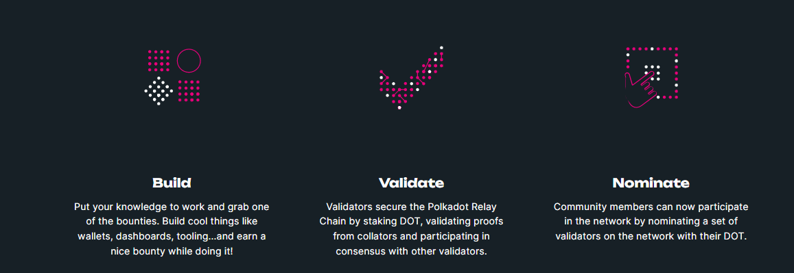
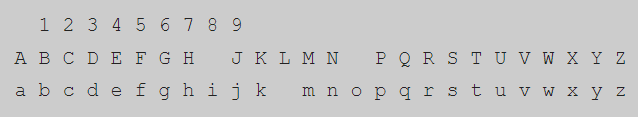
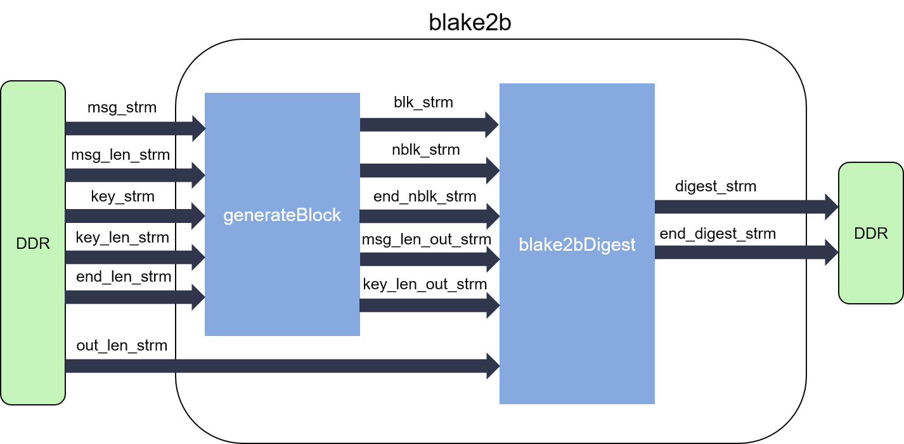

# Consensus

## Proof of Stake (PoS)

### Proof of Stake là gì?

Proof of Stake (PoS) là một thuật toán đồng thuận cho phép người dùng kiếm được phần thưởng cho việc xác thực các khối trên blockchain.

Trong PoS, để có thể trở thành validator thì người dùng cần dựa vào sức mạnh phần cứng của mình. Điều này đòi hỏi người dùng đầu tư các phần cứng mining đắt tiền và tiêu thụ lượng điện lớn.

Ngược lại, PoS hoạt động bằng cách chọn ngẫu nhiên validator dựa trên số lượng staked token trên chain. Lượng token sở hữu càng nhiều, khả năng được chọn làm validator càng lớn. Nếu validate sai thì người dùng phải chịu phạt là mất đi hết số lượng staked token.

### Ưu điểm

- Không đòi hỏi máy cấu hình cao, bất kỳ ai cũng có thể thiết lập các node chuyên biệt trên máy tính hoặc máy chủ (server) của riêng mình.
- Đôi khi có thể uỷ quyền (delegate) cho validator, nghĩa là người dùng gửi token cho validator để họ có thêm quyền vote, đổi lại người gửi cũng nhận được một phần phần thưởng mà không phải làm gì.
- Tăng khả năng mở rộng và tốc độ giao dịch, cải thiện tính phân quyền vì việc validate có thể được thực hiện bởi bất cứ ai staking token trong mạng, tạo ra một mạng lưới phi tập trung.
- Proof of Stake tiết kiệm môi trường hơn, không đòi hỏi tiêu thụ nhiều điện để hoạt động như Proof of Work.

### Nhược điểm

- Khi đã trở thành validator, người dùng sẽ được nhận thưởng từ việc xác thực, nhưng bị giảm vốn. Đôi khi sẽ bị thâm hụt mất phần đã stake ban đầu.
- Sẽ có trường hợp unlock cần phải đợi một khoảng thời gian. Điều này sẽ làm người dùng bị động khi giá token điều chỉnh. Ví dụ như LUNA unstake trên Terra Station tốn 15 ngày.
- Việc khóa (stake) token này liên quan đến quản trị. Điều này dẫn đến trường hợp blockchain mang tính tập trung: Một số ít người nắm nhiều token, quyền hạn quá lớn, gây ra sự domination trong các quyết định.
- Tính bảo mật kém vì ai cũng có thể trở thành validator chỉ bằng cách sở hữu lượng lớn token, khiến mạng dễ bị tấn công 51%. Ngoài ra, những validators này cũng có cơ hội lạm dụng quyền lực của mình.

## Nominated Proof of Stake (NPoS)

Để giải quyết những nhược điểm của PoS, NPoS ra đời.
NPoS là nơi mà các stakeholder có quyền chọn những validator cụ thể để tham gia vào cơ chế đồng thuận. Trong NPoS, có 2 role là <b>validators</b> và <b>nominators</b>. Trong NPoS, người dùng được khuyến khích tham gia vào việc bảo vệ mạng lưới bằng cách staking token và biểu quyết để bầu chọn validator có lịch sử hoạt động tốt. Chỉ các nút đã được đề cử mới được phép xác nhận các khối mới và kiếm phần thưởng.



<h4>CÁCH HOẠT ĐỘNG CỦA NPoS</h4>
Định kỳ vài lần trong ngày, hệ thống sẽ chọn ra một nhóm các node được gọi là các validator. Chúng sẽ đóng vai trò quan trọng trong các giao thức như sản xuất khối (block production) và finality gadget của phiên kế tiếp.

- Nhóm validator sẽ phải stake token theo dạng thế chấp, cam kết hoàn thành đúng nhiệm vụ. Bất kì hành động nào gây tổn hại đến giao thức, số token được stake sẽ bị cắt đi một phần. Ngược lại, nếu hoàn thành tốt, họ sẽ được thưởng. Tất cả các validator đều có trọng số như nhau (quyền biểu quyết như nhau) trong quá trình xác thực.

- Các nominator cũng sẽ khóa token chung với validator mà họ bầu chọn và nhận thưởng theo tỉ lệ token họ đóng góp. Ngược lại khi validator của họ không hoàn thành đúng nhiệm vụ hoặc gây tổn hại đến giao thức, họ cũng sẽ bị cắt một phần token trong pool. Staked token của nominator được phân phối cho những validators được bầu chọn sao cho càng đồng đều càng tốt.


Cơ chế này khiến cho các bên có ý đồ xấu rất khó để có được sự bầu chọn từ nominator (vì cần phải xây dựng một lượng lớn danh tiếng để có được sự ủng hộ) và sẽ rất tốn kém để tấn công hệ thống (bởi cuộc tấn công nào cũng sẽ dẫn đến việc cắt giảm một lượng lớn DOT).

NPoS cho phép hầu như tất cả các chủ sở hữu DOT tham gia một cách liên tục. Chính vì vậy sẽ duy trì được mức độ bảo mật cao bằng cách có những stake giá trị hơn và cho phép nhiều người kiếm được lợi nhuận dựa trên số vốn nắm giữ.

Polkadot sử dụng các công cụ từ lý thuyết bầu cử (election theory) đến lý thuyết trò chơi (game theory) để tối ưu hóa rời rạc, nhằm phát triển một quy trình bầu chọn hiệu quả mang lại sự đại diện và bảo mật công bằng.

## NPoS Election algorithms
Như đã nói ở trên, các validator có quyền gần như bằng nhau, nên điều quan trọng là phải đảm bảo số lượng staked token của mỗi validator được phân bố đồng đều. Polkadot sử dụng một thuật toán bầu cử (election algorithm) để tối ưu hoá 3 tham số khi tính toán solution graph của nominators và validators:
- Maximize tổng số token at stake (số token sẽ mất nếu validate sai)
- Maximize staked token của validator đang có stake thấp nhất
- Minimize phương sai (variance) của stake trong set

Sequential Phragmén, Phragmms, và Star balancing là một số thuật toán đáng chú ý mà Polkadot sử dụng.

### Sequential Phragmén
Vào cuối thế kỷ 19, nhà toán học Thụy Điển Lars Edvard Phragmén đã đề xuất một phương pháp để bầu các thành viên vào quốc hội trong nước. Ông nhận thấy rằng những phương pháp bầu cử thời điểm đó có xu hướng nhường tất cả các ghế cho chính đảng phổ biến nhất.

Ngược lại, phương pháp mới của ông đảm bảo rằng số ghế được ấn định cho mỗi đảng tỷ lệ thuận với số phiếu được trao cho họ, vì vậy nó giúp mang lại nhiều sự đại diện hơn cho bên thiểu số.

#### Basic Phragmén

## BABE

## GRANDPA

## Hybrid consensus

## Randomness

## Staking miners

# Accounts

## Address format

Polkadot sử dụng định dạng địa chỉ mặc định của Substrate-based chains là SS58. Đây là một định dạng được chỉnh sửa từ Bitcoin Base-58-check. Tiền tố của định dạng này thay đổi tuỳ thuộc theo loại chain.

Về cơ bản, một địa chỉ SS58 được mã hoá theo dạng sau:
`base58encode ( concat ( <address-type>, <address>, <checksum> ) )`

Trong đó, base58encode là một hàm mã hoá sử dụng base58 scheme.



## Derivation paths

Deviration paths cho phép chúng ta có thể tạo và quản lý nhiều account cùng một gốc (seed). Chúng ta có thể coi các accounts phái sinh (derived accounts) là những accounts con của một account gốc, được tạo ra bằng cách sử dụng mnemonic seed phrase ban đầu.

Có 3 loại:

- Hard derivation
  `'caution juice atom organ advance problem want pledge someone senior holiday very//0'`
- Soft derivation
  `'caution juice atom organ advance problem want pledge someone senior holiday very/0'`

Để tạo ra một account phái sinh, chúng ta chỉ cần thay đổi số ở cuối mnemonic seed phrase trên. Chúng ta cũng có thể tự đặt custom derivation path cho mình, ví dụ:
`//john/polkadot/initial`

- Password derivation:
  `'caution juice atom organ advance problem want pledge someone senior holiday very///0'`

Đối với 2 loại trên, nếu ai đó biết mnemonic seed phrase và derivation path, họ có thể truy cập vào trong tài khoản đó. Còn trong loại này, chỉ có thể tạo và truy cập tài khoản phái sinh nếu chúng ta có mật khẩu. Nói cách khác, về mặt toán học, khi chúng ta biết được derivation path (về mặt văn bản) và mật khẩu, chúng ta có thể tính toán ra path thực tế thông qua hàm f(written path, password). Sau đó, chúng ta sẽ tìm được key pair thông qua hàm f(seed, real path) để truy cập vào tài khoản.

- So sánh soft & hard derivation:
  - Soft derivation cho phép người dùng "truy ngược" để tìm ra private key của account gốc nếu họ biết private key của account phái sinh. Ngoài ra, soft derivation thể hiện được sự liên kết giữa các accounts cùng seed. Nói cách khác, soft derivation cho phép proof-of-parent.
  - Hard derivation không cho phép điều đó

## Advanced Staking Concepts

### Staking proxies

Polkadot cho phép tạo ra các account có chức năng đặc biệt, gọi là <b>proxy account</b>

# Cryptography

## Hashing algorithm

Polkadot sử dụng thuật toán Blake2b.



Blake2b có thể được chia thành 2 phần:

- Module generateBlock: pad đầu vào thành các khối fixed size sau đó thông báo cho module digest. Mỗi khối (chunk) trong blake2b có 16 message words (128-byte chunk), mỗi message word là 64 bits (8-byte word).
- Module blake2bDigest: Tính toán hash values

Ví dụ:

```
BLAKE2b-512("The quick brown fox jumps over the lazy dog") =
a8add4bdddfd93e4877d2746e62817b116364a1fa7bc148d95090bc7333b3673f82401cf7aa2e4cb1ecd90296e3f14cb5413f8ed77be73045b13914cdcd6a918
BLAKE2b-512("The quick brown fox jumps over the lazy dof") =
ab6b007747d8068c02e25a6008db8a77c218d94f3b40d2291a7dc8a62090a744c082ea27af01521a102e42f480a31e9844053f456b4b41e8aa78bbe5c12957bb
```

Chúng ta có thể thấy, chỉ đổi 1 ký tự của message cũng làm thay đổi hash value khá nhiều, thể hiện avalanche effect: "Khi một bit đầu vào bị thay đổi, xác suất 1 bit đầu ra bị thay đổi là 50%".

Chi tiết thuật toán Blake2b được trình bày trong phần dưới đây.

### Initialize vectors

Vector khởi tạo (Initialize vector - IV) là một số tuỳ ý có thể được sử dụng với private key để mã hoá dữ liệu. IV còn được gọi là nonce (number used once), chỉ được sử dụng một lần trong bất kỳ phiên nào để ngăn chặn việc giải mã trái phép dữ liệu.

Blake2b tính toán IV bằng cách lấy 64 bit đầu tiên trong phần thập phân của căn bậc hai tám số nguyên tố đầu tiên.

```
IV0 = 0x6a09e667f3bcc908   // Frac(sqrt(2))
IV1 = 0xbb67ae8584caa73b   // Frac(sqrt(3))
IV2 = 0x3c6ef372fe94f82b   // Frac(sqrt(5))
IV3 = 0xa54ff53a5f1d36f1   // Frac(sqrt(7))
IV4 = 0x510e527fade682d1   // Frac(sqrt(11))
IV5 = 0x9b05688c2b3e6c1f   // Frac(sqrt(13))
IV6 = 0x1f83d9abfb41bd6b   // Frac(sqrt(17))
IV7 = 0x5be0cd19137e2179   // Frac(sqrt(19))
```

### Algorithm

Pseudocode của thuật toán blake2b. Tham khảo thêm tại https://en.wikipedia.org/wiki/BLAKE_(hash_function)#BLAKE2b_algorithm

```
Algorithm BLAKE2b
   Input:
      M                               Message to be hashed
      cbMessageLen: Number, (0..2128)  Length of the message in bytes
      Key                             Optional 0..64 byte key
      cbKeyLen: Number, (0..64)       Length of optional key in bytes
      cbHashLen: Number, (1..64)      Desired hash length in bytes
   Output:
      Hash                            Hash of cbHashLen bytes

   Initialize State vector h with IV
   h0..7 ← IV0..7

   Mix key size (cbKeyLen) and desired hash length (cbHashLen) into h0
   h0 ← h0 xor 0x0101kknn
         where kk is Key Length (in bytes)
               nn is Desired Hash Length (in bytes)

   Each time we Compress we record how many bytes have been compressed
   cBytesCompressed ← 0
   cBytesRemaining  ← cbMessageLen

   If there was a key supplied (i.e. cbKeyLen > 0)
   then pad with trailing zeros to make it 128-bytes (i.e. 16 words)
   and prepend it to the message M
   if (cbKeyLen > 0) then
      M ← Pad(Key, 128) || M
      cBytesRemaining ← cBytesRemaining + 128
   end if

   Compress whole 128-byte chunks of the message, except the last chunk
   while (cBytesRemaining > 128) do
      chunk ← get next 128 bytes of message M
      cBytesCompressed ← cBytesCompressed + 128  increase count of bytes that have been compressed
      cBytesRemaining  ← cBytesRemaining  - 128  decrease count of bytes in M remaining to be processed

      h ← Compress(h, chunk, cBytesCompressed, false)  false ⇒ this is not the last chunk
   end while

   Compress the final bytes from M
   chunk ← get next 128 bytes of message M  We will get cBytesRemaining bytes (i.e. 0..128 bytes)
   cBytesCompressed ← cBytesCompressed+cBytesRemaining  The actual number of bytes leftover in M
   chunk ← Pad(chunk, 128)  If M was empty, then we will still compress a final chunk of zeros

   h ← Compress(h, chunk, cBytesCompressed, true)  true ⇒ this is the last chunk

   Result ← first cbHashLen bytes of little endian state vector h
End Algorithm BLAKE2b
```

## Keypairs and signing

Như đã biết, Bitcoin thực thi quyền sở hữu bằng một thuật toán gọi là Chữ ký kỹ thuật số đường cong Elliptic (Elliptic Curve Digital Signature Algorithm, gọi tắt là ECDSA). Thuật toán này cho phép chúng ta lấy một số (tức khóa riêng tư) và tạo ra một khóa công khai từ đó.

Polkadot sử dụng thuật toán tương tự thay thế cho ECDSA là Schnorrkel/Ristretto x25519 (SR25519) để sinh khoá.

SR25519 là thuật toán dựa trên Curve25519, một dạng đường cong Elliptic.

Đường cong Elliptic được ứng dụng nhiều trong mật mã học. Về cơ bản, đường cong elliptic có dạng tổng quát phương trình Weierstrass như sau:

$$
y^2 + a_1xy + a_3xy = x^3 + a_2x^2 + a_4x + a_6
$$

Sau 1 số phép thế và phép biến đổi thì phương trình rút gọn chỉ còn:

$$
y^2 = x^3 + Ax + B
$$

Với điều kiện:

$$
4A^3 + 27B^2 \neq 0
$$

Đây cũng là dạng chủ yếu xuất hiện trong các tài liệu.

Mật mã đường cong Elliptic (ECC) sử dụng các tính chất toán học của đường cong Elliptic để tạo ra các hệ thống mật mã khóa công khai (khóa mà bạn sử dụng để mã hóa dữ liệu của mình có thể được công khai trong khi khóa được sử dụng để giải mã dữ liệu của bạn có thể được giữ kín). Giống như tất cả các mật mã khóa công khai, ECC dựa trên các hàm toán học đơn giản để tính toán theo một hướng, nhưng rất khó để đảo ngược. Độ an toàn của ECC dựa vào bài toán logarit rời rạc trên nhóm các điểm của đường cong Elliptic.

Đường cong Elliptic Curve25519 được thiết kế để sử dụng với giao thức Elliptic-curve Diffie-Hellman (ECDH). Cụ thể, phương trình đường cong được viết dưới dạng:

$$
y^2 = x^3 + 486662x^2 + x
$$

Đây là một Montgomery curve, đồ thị có dạng sau:


Như đã nói ở trên, Polkadot không dùng thuật toán ECDSA mà sử dụng thuật toán chữ ký Schnorr. Loại chữ ký này sở hữu một đặc tính mạnh mẽ là <b>độ tuyến tính</b>. Dễ hiểu hơn, điều này làm cho loại chữ ký này này đặc biệt phù hợp với các giao dịch đa chữ ký. (Tham khảo thêm ở <a href="https://en.wikipedia.org/wiki/Schnorr_signature">đây</a>)

## Keys

Key trong Polkadot được chia làm 3 loại

- Account Keys
- "Controller" & "Stash" Keys
- Session Keys
